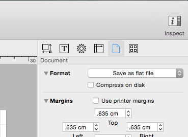

# SU Concept Map

This repo uses the [GitFlow branching model](http://nvie.com/posts/a-successful-git-branching-model/).

To let git track changes in the underlying XML structure of the .graffle file, choose to save as a flat file:
